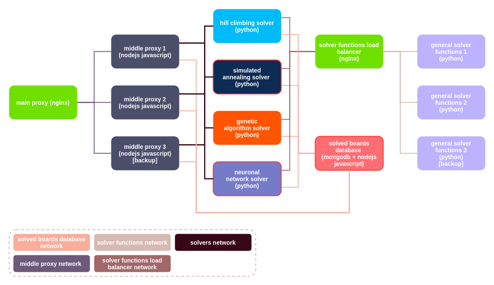

# About this repository

This repository contains a small sudoku solver API that uses four different solving methods and is based on Docker containerized microservices, the API was designed to be modular, following this design every solver is in an individual container with its own APIs, making the API highly reliable, so even if a solver stops working the other solvers won't stop, this design is also secure because just the reverse proxy port is exposed and used for all the requests, all the containers excluding the reverse proxy container work just with Docker networks this makes the containers inaccessible from out of the server, being modular the API is also highly scalable, if a solver needs to be updated the update affects just their respective container leaving the code of the others intact.\
Finally, this API is designed to work as a Docker compose application, so some replicas are not defined in the best way in the compose file.

 

## About the environment variables

The environment variables that the application uses in the compose file are defined in an env file, in other conditions this file should be excluded from the repository. Taking in account that this is a personal project that is never going to be in production, having the env file in the repository doesn't make any difference.

 
